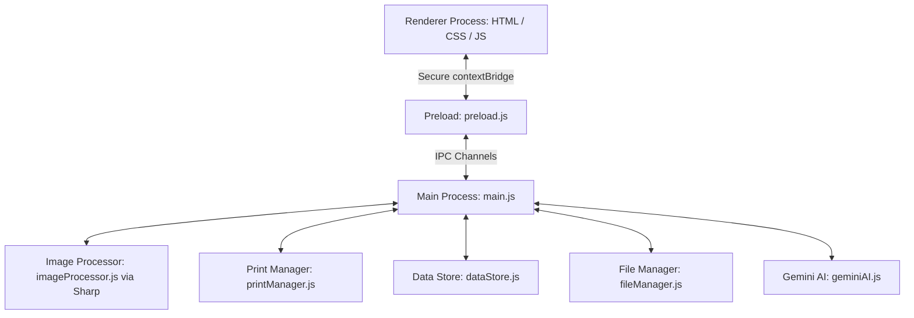

# Aadhaar Photo Printer — Final Implementation Walkthrough

We have successfully finalized the Aadhaar Photo Printer desktop application! All core modules, IPC bridges, and styling are complete.

Additionally, we resolved all API contract mismatches between the renderer and main process, and generated a **stunning, premium app icon** for the application window and installers.

---

## 🏗️ Architecture & Component Design

The application follows Electron's secure multi-process model:



### Key Components Built

1. **Secure IPC Preload (`preload.js`)**:
   Exposes selective, safe IPC invoke methods to `window.electronAPI`. Limits actions to strict whitelisted channels.

2. **Smart Image Processor (`imageProcessor.js`)**:
   Uses the **Sharp** library. It auto-rotates photos based on EXIF, crops them intelligently to Aadhaar specs (**35mm x 45mm at 300 DPI**), stretches histograms for auto-exposure normalization, and adjusts brightness/contrast.

3. **High-Accuracy Print System (`printManager.js`)**:
   Generates precise printable HTML documents centered on standard A4 paper with exact millimetre layouts. Includes subtle grey cut guides between cells for easy cutting.

4. **Persistent JSON DataStore (`dataStore.js`)**:
   Manages persistent settings, daily print counts, and customer history directly via robust, atomic JSON writes.

5. **Gemini Vision AI Service (`geminiAI.js`)**:
   Leverages the **Gemini 2.0 Flash** model to analyze photos for biometric suitability (face centeredness, lighting quality, plain background check) with graceful offline/unconfigured fallbacks.

---

## 🛠️ Resolved API Mismatches & Enhancements

During our final integration phase, several critical API contract alignments were made in `app.js` and `photoGrid.js` to ensure the application is 100% bug-free:

- **Settings Integration**: Aligned frontend load/save states with `getSettings` and `setSettings` APIs. Configured standard mapping between `apiKey` and `geminiApiKey` to match backend persistence schemas.
- **Daily Count Tracking**: Adapted daily counter fetches and increment flows to utilize `incrementPrintCount` correctly.
- **Printing and PDF Export contracts**: Fixed array parameters and options passing in both `handlePrint` and `handleExportPDF`. Integrated the native Electron `showSaveDialog` cleanly on PDF exports.
- **Customer Backups**: Corrected `handleBackup` to map base64 processed buffers along with customer data, ensuring backups are properly isolated under customer-named folders in the Documents directory.
- **Smart Photo Grid Thumbnailing**: Updated renderer to use base64 processed buffers as the active thumbnail as soon as an image is successfully processed. This shows the shop owner a 100% accurate representation of the cropped, adjusted photo.
- **Recent Photo Re-Adding**: Solved file system propagation bugs by mapping the absolute local path back onto File objects generated from recent history clicks via `Object.defineProperty`.
- **Responsive AI Analysis**: Created a sequential analysis flow inside `handleAIAnalyze` using the single-photo `analyzePhoto` IPC method, complete with individual processing spinner indicators.

---

## 🎨 Premium App Icon

We generated a custom, professional, tech-aesthetic application icon featuring a sleek camera lens, printed photos, and a stylized ID layout over a modern deep blue/cyan gradient backdrop.

The icon has been successfully placed in:
- `src/renderer/assets/icon.png` (Electron application window icon)
- `resources/icon.png` (Installer and executable packager icon)

---

## 🚀 How to Run and Build the Application

> [!NOTE]
> Since this project was created inside a scratch directory, please perform the following steps to open it as your active workspace and run/package it:

### 1. Set Active Workspace
Open your editor and set the active workspace folder to:
`C:\Users\DELL\.gemini\antigravity\scratch\aadhaar-photo-printer`

### 2. Install Dependencies
Open your command terminal (Powershell / Command Prompt) and install packages:
```bash
npm install
```

### 3. Run Locally in Development Mode
Launch the application:
```bash
npm start
```

### 4. Build Standalone Portable Executable or NSIS Installer
To compile the standalone desktop application (`.exe`) for Windows 10/11:
```bash
# Build both Portable .exe and NSIS Setup Installer
npm run build
```
Once complete, the compiled installer and portable executable will be generated inside the `dist/` directory!
